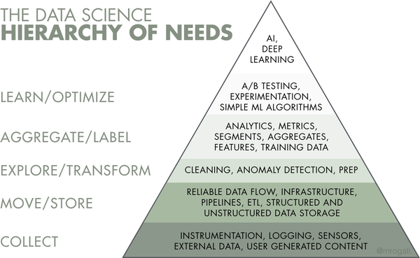

# What is DE
DE develop/implement/maintain the systems/processes that takes the raw data and produce high-quality, consistent info that supports downstream use cases (Data Analysis, Machine Learning).

Raw Data -> [Data Engineering] -> Usage (DAA, ML)

## DE Life Cycle
5 stages:  
Generation, Storage, Ingestion, Transformation, Serving

Undercurrents: critical ideas across the entire lifecycle, including security, data management, DataOps, data architecture, orchestration, and software engineering.

## Relationship between DE & DS/DA
DE is upstream (lower level), DS/DA is downstream (upper level)

# DE Skills and Activities
## Data Maturity
Data maturity is a helpful guide to understanding the types of data challenges a company will face as it grows its data capability.

3 Stages of data maturity (with list of responsibilities of DE):  
1. Starting with Data
    - Get buy-in from key stakeholders, including executive management.
    - Define the right data architecture
    - Identify and audit data that will support key initiatives and operate within the data architecture you designed.
    - Build a solid data foundation for future DA and DS
2. Scaling with Data
    - Establish formal data practices
    - Create scalable and robust data architectures
    - Adopt DevOps and DataOps practices
    - Build systems that support ML
    - Continue to avoid undifferentiated heavy lifting and customize only when a competitive advantage results
3. Leading with Data
    - Create automation for the seamless introduction and usage of new data
    - Focus on building custom tools and systems that leverage data as a competitive advantage
    - Focus on the “enterprisey” aspects of data, such as data management (including data governance and quality) and DataOps
    - Deploy tools that expose and disseminate data throughout the organization, including data catalogs, data lineage tools, and metadata management systems
    - Collaborate efficiently with software engineers, ML engineers, analysts, and others
    - Create a community and environment where people can collaborate and speak openly, no matter their role or position

## Technical Responsibilities
DE must understand how to build architectures that optimize performance and cost at a high level, using prepackaged or homegrown components. 

**Languages**:  
Primary: SQL, Python, Java, Bash  
Secondary: R, JS, Go, Rust, C/C++, Julia

## Two Types of DEs
**Type A**:  
A stands for *abstraction*. Type A DE avoid reinventing the wheel, use accessible tools to manage DE lifecycle. This kind of DE work at companies across industries and at all levels of data maturity.

**Type B**:  
B stands for *build*. Type B DE build data tools and systems that scale and leverage a company’s core competency and competitive advantage. (Data maturity stage 2 or 3)

# DE Inside An Organization
