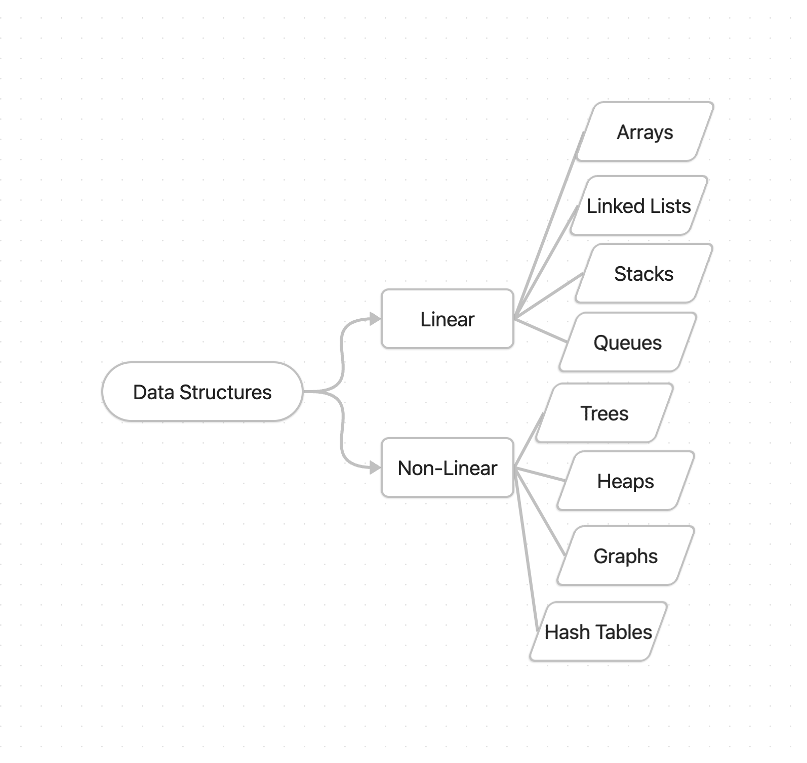

Choice of a particular data structure has 2 rules:  
1. Able to process the data efficiently when necessary
2. Able to represent the inherent relationship of the data in the real world

## Data Type
**Primitive Data Type**  
Inbuilt in the langauge, like lists and dictionaries in Python

**User-Defined Data Type**  
Ex: struct, union and enum in C

**Abstract Data Type (ADT)**  
Defined by what operations can be performed, not how.

## Common Operations
Access, Search, Insertion, Deletion

## Classification of Data Structures
