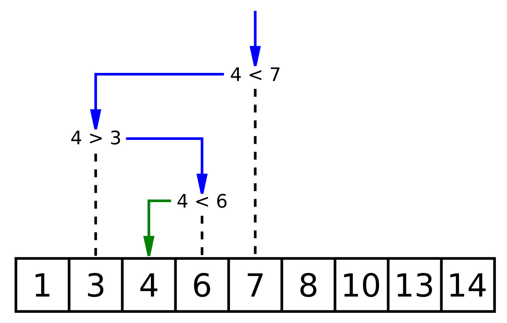

search: return a position, or check if it exists

# Linear Search
```Python
def linear_search(arr, target):
    """
    Perform linear search on the array.

    Parameters:
    arr (list): The list to search through.
    target (any): The value to search for.

    Returns:
    int: The index of the target element if found, else -1.
    """
    for index in range(len(arr)):
        if arr[index] == target:
            return index  # Return the index if found
    return -1  # Return -1 if the target is not found

# Example usage
arr = [10, 20, 30, 40, 50]
target = 30
result = linear_search(arr, target)

if result != -1:
    print(f"Element {target} found at index {result}")
else:
    print(f"Element {target} not found in the array")
```

**Best Use Case**: when elements are unsorted, and the search is to be performed only once. Also small list is preferred.

Time Complexity:  
Average: O(n)  
Best: O(1)  
Worst: O(n)  

# Binary Search

Prerequisite: array must be sorted

```Python
def binary_search(arr, target):
    """
    Perform binary search on a sorted array.

    Parameters:
    arr (list): The sorted list to search through.
    target (any): The value to search for.

    Returns:
    int: The index of the target element if found, else -1.
    """
    low, high = 0, len(arr) - 1
    
    while low <= high:
        mid = (low + high) // 2  # Find the middle index
        
        if arr[mid] == target:
            return mid  # Target found at index `mid`
        elif arr[mid] < target:
            low = mid + 1  # Search in the right half
        else:
            high = mid - 1  # Search in the left half
    
    return -1  # Target not found

# Example usage
arr = [10, 20, 30, 40, 50]  # Must be sorted
target = 30
result = binary_search(arr, target)

if result != -1:
    print(f"Element {target} found at index {result}")
else:
    print(f"Element {target} not found in the array")
```
**Best Use Case**: elements sorted already, list size can be very large

Time Complexity:  
Average: O(log n)  
Best: O(1)  
Worst: O(n)